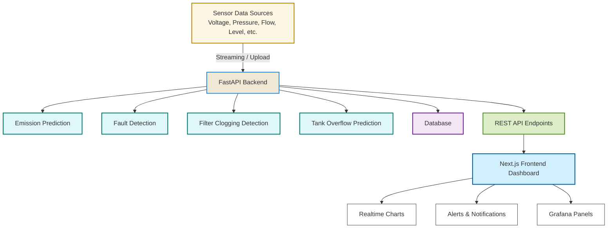

# Remote monitoring of Utility Parameters

A full-stack web application that provides real-time monitoring and predictive analytics for industrial operations. The dashboard uses machine learning models to predict:

1. Greenhouse gas (GHG) emissions  
2. Equipment faults in motors and pumps  
3. Filter clogging in filtration units  
4. Tank overfilling and inventory levels

Built with **Next.js**, **FastAPI**, and **Tailwind CSS**, this system empowers plant operators and analysts with actionable insights through an interactive dashboard.

---

##  Features

- Live dashboard with charts and alerts
- Predictive insights from trained ML models
- Fault detection in pumps and motors
- Emission estimation based on utility parameters
- Filter clogging detection via pressure anomalies
- Tank overfilling alerts using level and flow rate analysis
- Secure API integration and environment-based config

---

##  Tech Stack

| Layer       | Technology        |
|-------------|-------------------|
| Frontend    | Next.js, Tailwind CSS, Recharts |
| Backend     | FastAPI, Python |
| ML Models   | scikit-learn, RandomForestRegressor |
| Database    | MongoDB  |
| Visualization | Grafana (iframe embedding) |
| Deployment  |Render|

---

## Architecture

